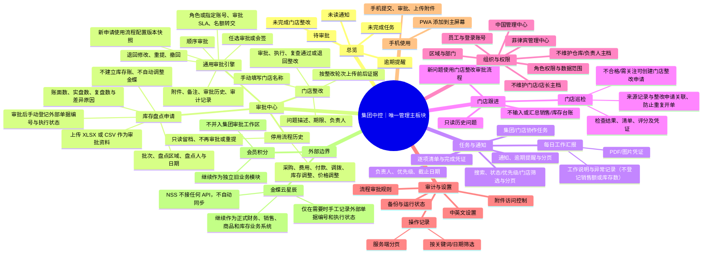

# NSS Solar 集团中控平台｜最终确认架构

## 范围边界

- 侧栏以“集团中控”为唯一管理主板块，首页和工作区都归在这个主板块下。
- 不设置独立“经营”主板块，不展示或计算金蝶已经负责的销售、财务、商品和库存台账。
- 不接入金蝶云星辰 API 或其他金蝶接口，也不复制金蝶正式进销存能力。
- 移除集团中控内的门店档案/店长名册、仓库档案/负责人名册维护。
- 取消采购、费用报销、付款、库存调拨、库存调整、价格调整六类新审批流程。
- 只保留库存盘点申请审批和门店整改两类流程。
- 会员积分是既有独立业务，和集团中控的审批、任务、审计数据分开。

## 思维导图

## 中控内部工作区

1. 总览：待审批、未完成任务、未完成门店整改、未读通知数量，点击可进入对应工作区。
2. 审批中心：两类有效流程、通用审批、附件/备注/记录；六类取消流程只在折叠历史区只读显示。
3. 任务与通知：集团/门店协作任务、站内通知、逾期处理。
4. 门店跟进：工作汇报、巡检、只读历史问题记录；新问题从审批中心提交门店整改流程。
5. 审计与设置：组织与员工权限、审批路径、操作审计。

## 门店和仓库数据边界

集团中控不提供门店或仓库主档及负责人名册。盘点申请和门店整改申请手动填写地点名称；管理人员按账号权限手工指派执行责任。会员积分旧模块目前仍依赖自身既有门店数据，本次架构调整不会把它迁入中控，也不会修改或删除生产数据。

## 当前实施状态

本地开发副本按以上范围收敛：新申请、审批路径仅保留盘点与整改；旧六类流程在界面只读归档，后端禁止继续变更；独立门店问题登记/关闭写接口已停用，历史问题只读。审批、任务、通知、日报、巡检及问题历史均分页；日报/巡检可传凭证；巡检问题可关联整改申请并自动复制来源凭证；审计可按关键词、日期范围筛选。本地代码尚未部署生产。源码包提供使用 V2 独立目录和共享数据备份、版本切换及失败回滚的发布脚本，不触碰旧会员积分程序目录。

## 可选增强与发布准备

任务模板/周期任务、外部推送渠道、审计 CSV 导出属于后续可选增强；当前核心审批与门店整改闭环已实现。生产备份恢复演练、代码发布检查和逐角色人工验收属于部署准备，不能由本地功能开发替代。
